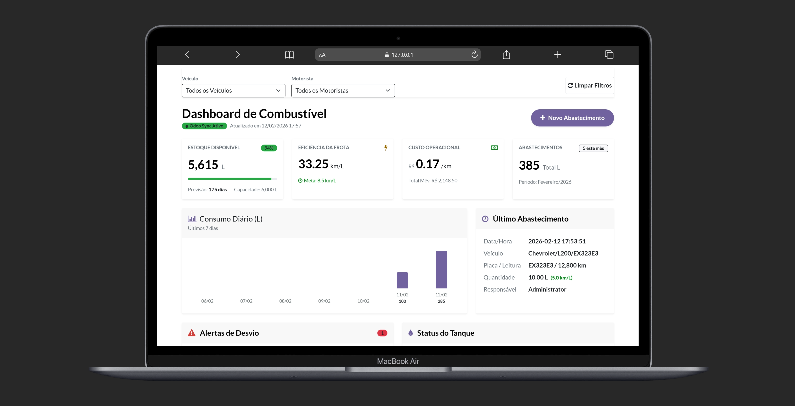

# ⛽ Controle de Combustível - MachadoERP

Um módulo simples e eficiente para gestão de abastecimentos e controle de estoque de combustível no Odoo 19.



## 📋 Sobre o Projeto

Este projeto foi desenvolvido como parte de um **desafio técnico** proposto pela empresa **MachadoERP** para um processo seletivo. O objetivo foi demonstrar habilidades técnicas na estruturação de módulos Odoo, organização de banco de dados e criação de interfaces focadas em experiência do usuário.

### ✨ Diferenciais:
*   **Abastecimento Prático**: Registro por veículo, placa e motorista integrado à Frota.
*   **Segurança**: Registros confirmados são imutáveis (apenas administradores podem ajustar).
*   **Dashboard BI**: Visualização de consumo (km/L), custo/km e status do tanque em tempo real.
*   **Controle de Estoque**: Gestão de tanque de 6.000L com alertas de nível baixo.

## 🚀 Como Rodar o Sistema (Passo a Passo)

Para rodar o sistema do zero em sua máquina local, siga estas instruções:

### 1. Preparar o Ambiente
Certifique-se de estar na raiz do projeto e ative o ambiente virtual Python:
```bash
# No Windows (PowerShell/CMD):
.\odoo-venv\Scripts\activate
```

### 2. Iniciar o Servidor Odoo
Execute o comando abaixo para iniciar o serviço com o módulo de combustível carregado:
```bash
.\odoo-venv\Scripts\python.exe odoo-19.0\odoo-bin -r odoo -w odoo --db_host 127.0.0.1 --db_port 5432 --addons-path odoo-19.0\addons,controle_combustivel\.. -d erp_final --limit-time-real=3600
```

### 3. Acessar o Sistema
Abra seu navegador e acesse o endereço:
*   **URL**: [http://localhost:8069](http://localhost:8069)
*   **Banco de Dados**: `erp_final`
*   **Usuário**: `admin`
*   **Senha**: `admin`

## 🛠️ Tecnologias
*   **Odoo 19.0**
*   **Python**
*   **PostgreSQL**
*   **XML / QWeb**

---

